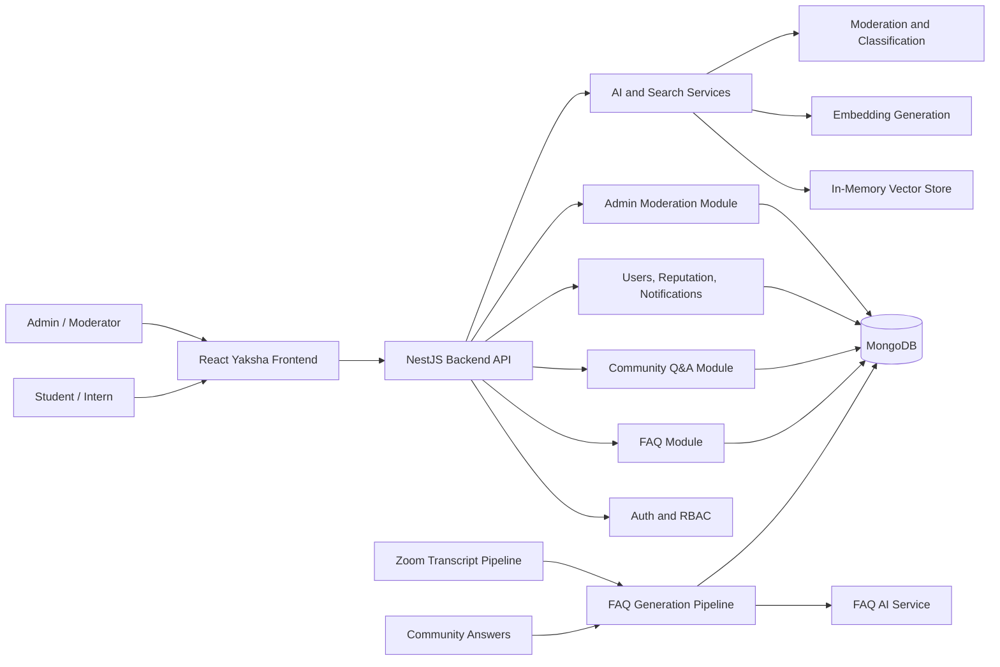
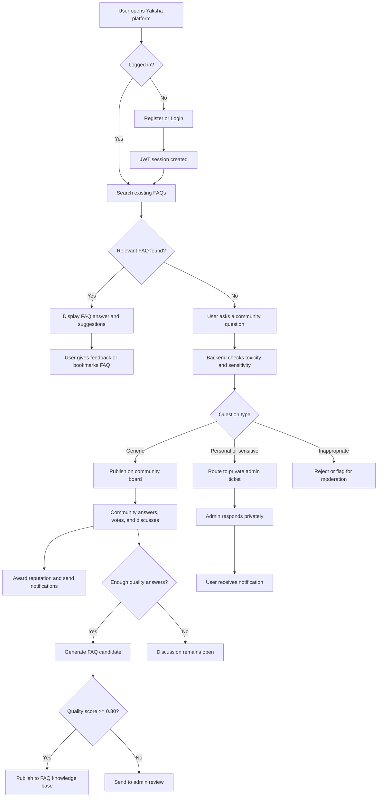
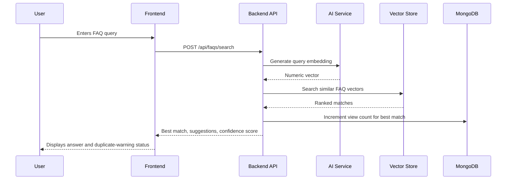
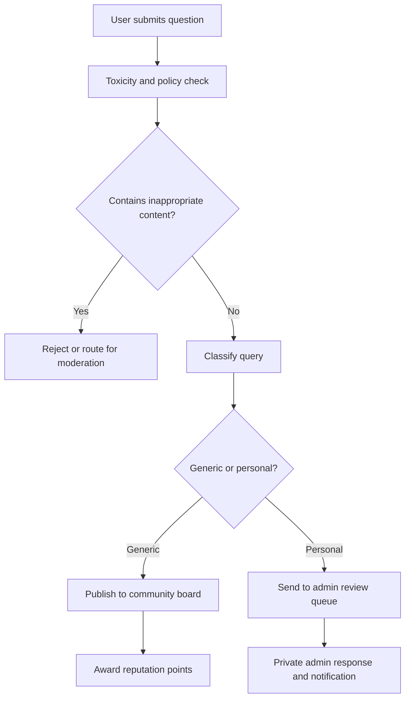
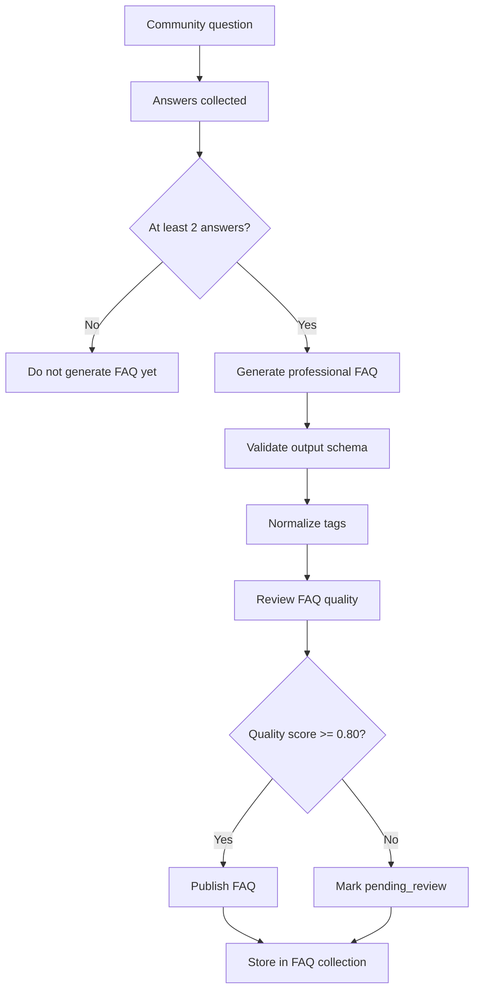

# AI-Powered Crowd-Sourced Dynamic FAQ Platform

This repository contains a full-stack FAQ and community Q&A platform developed as part of the IIT Ropar internship work. The system combines a React frontend, a NestJS backend, MongoDB persistence, vector-based FAQ retrieval, role-based moderation, AI-assisted query classification, and automated FAQ generation from community answers or Zoom transcripts.

The platform is designed to reduce repeated mentor queries, route sensitive questions away from public discussion, and convert high-quality community knowledge into reusable FAQ entries.

## Table of Contents

- [AI-Powered Crowd-Sourced Dynamic FAQ Platform](#ai-powered-crowd-sourced-dynamic-faq-platform)
  - [Table of Contents](#table-of-contents)
  - [Project Overview](#project-overview)
  - [Core Features](#core-features)
  - [System Architecture](#system-architecture)
  - [Major Data Flows](#major-data-flows)
    - [User Flow](#user-flow)
    - [FAQ Search Flow](#faq-search-flow)
    - [Community Question Flow](#community-question-flow)
    - [Automated FAQ Generation Flow](#automated-faq-generation-flow)
  - [Backend Module Summary](#backend-module-summary)
  - [TypeScript File Guide](#typescript-file-guide)
    - [Backend Root Files](#backend-root-files)
    - [Backend Admin Files](#backend-admin-files)
    - [Backend AI Files](#backend-ai-files)
    - [Backend AI Search Files](#backend-ai-search-files)
    - [Backend Authentication Files](#backend-authentication-files)
    - [Backend FAQ Files](#backend-faq-files)
    - [Backend Question Files](#backend-question-files)
    - [Backend User Files](#backend-user-files)
    - [Backend Shared and Config Files](#backend-shared-and-config-files)
    - [FAQ AI Service Files](#faq-ai-service-files)
    - [FAQ Generation Files](#faq-generation-files)
  - [Frontend File Guide](#frontend-file-guide)
  - [AI Function Modules](#ai-function-modules)
    - [Query Classification](#query-classification)
    - [FAQ Generation and Knowledge Creation](#faq-generation-and-knowledge-creation)
    - [FAQ AI Service](#faq-ai-service)
  - [Setup and Execution](#setup-and-execution)
    - [Prerequisites](#prerequisites)
    - [Backend](#backend)
    - [FAQ AI Service](#faq-ai-service-1)
    - [FAQ Generation Pipeline](#faq-generation-pipeline)
    - [Query Classification](#query-classification-1)
    - [Frontend](#frontend)
  - [Environment Variables](#environment-variables)
  - [Testing](#testing)
  - [Data Files](#data-files)
  - [Known Integration Notes](#known-integration-notes)
  - [License](#license)

## Project Overview

The project is organized around four main layers:

1. **Frontend application**: A React interface named Yaksha that demonstrates FAQ search, community discussion, profile views, and administrative moderation workflows.
2. **Backend API**: A NestJS server exposing REST endpoints for authentication, FAQ search, Q&A, user management, admin moderation, AI services, and Swagger API documentation.
3. **AI services**: TypeScript and Python modules for LLM prompt construction, FAQ generation, quality review, tag generation, moderation, query classification, and transcript processing.
4. **Knowledge base data**: A Vicharanashala FAQ JSON dataset used for FAQ search, classification, and pipeline demonstrations.

## Core Features

- JWT-based user registration, login, and protected sessions.
- Role-based access control for users, moderators, and administrators.
- FAQ browsing, similarity search, feedback collection, and bookmarking.
- Community Q&A with questions, answers, voting, accepted answers, and saved posts.
- Reputation points and notification generation for user activity.
- Admin dashboards for analytics, personal query review, content moderation, and FAQ candidate approval.
- Query classification into generic, personal, or inappropriate categories.
- Vector search using embeddings and cosine similarity.
- Automated FAQ generation from community answer threads.
- Zoom transcript processing for extracting FAQ candidates from mentoring sessions.
- Swagger documentation exposed by the backend at `/api/docs`.

## Technology Stack

| Area | Technologies |
| --- | --- |
| Frontend | React, React Router, TanStack Query, Motion, Lucide React |
| Backend | NestJS, TypeScript, MongoDB, Mongoose, Passport JWT, Swagger |
| AI Service Layer | TypeScript, Axios, dotenv, LLM prompt templates, JSON validators |
| Query Classification | Python standard library, regex rules, keyword similarity |
| Data | JSON FAQ dataset, MongoDB collections |
| Tooling | npm, ts-node, TypeScript, Jest |

## Directory Structure

```text
cs45/
|-- README.md
|-- LICENSE
|-- vicharanashala_faq.json
|-- backend/
|   |-- package.json
|   |-- nest-cli.json
|   |-- tsconfig.json
|   |-- tsconfig.build.json
|   |-- vicharanashala_faq.json
|   |-- src/
|   |   |-- main.ts
|   |   |-- app.module.ts
|   |   |-- admin/
|   |   |   |-- admin.controller.ts
|   |   |   |-- admin.service.ts
|   |   |   |-- admin.module.ts
|   |   |   |-- moderation-log.schema.ts
|   |   |-- ai/
|   |   |   |-- ai.service.ts
|   |   |   |-- ai.module.ts
|   |   |   |-- vector-store.service.ts
|   |   |   |-- interfaces/
|   |   |       |-- ai-service.interface.ts
|   |   |       |-- vector-store.interface.ts
|   |   |-- ai-search/
|   |   |   |-- ai-search.controller.ts
|   |   |   |-- ai-search.service.ts
|   |   |   |-- ai-search.module.ts
|   |   |   |-- embedding-cache.service.ts
|   |   |   |-- minimax-embedding.client.ts
|   |   |   |-- dto/
|   |   |   |   |-- search.dto.ts
|   |   |   |-- test/
|   |   |       |-- cosine.spec.ts
|   |   |-- auth/
|   |   |-- common/
|   |   |-- config/
|   |   |-- faqs/
|   |   |-- questions/
|   |   |-- users/
|   |   |-- seed.ts
|   |-- test/
|       |-- features.e2e-spec.ts
|       |-- user-flows.e2e-spec.ts
|       |-- jest-e2e.json
|-- frontend/
|   |-- App.jsx
|   |-- main.jsx
|   |-- styles.css
|   |-- pages/
|   |-- components/
|   |   |-- ui.jsx
|   |   |-- yaksha/
|   |       |-- AdminPanel.jsx
|   |       |-- Community.jsx
|   |       |-- Navbar.jsx
|   |       |-- Profile.jsx
|   |       |-- YakshaSearch.jsx
|   |       |-- mockData.js
|   |-- hooks/
|   |-- lib/
|-- ai_functions/
    |-- faq_ai_service/
    |   |-- package.json
    |   |-- tsconfig.json
    |   |-- src/
    |       |-- interfaces/
    |       |-- minimax/
    |       |-- prompts/
    |       |-- services/
    |       |-- validators/
    |       |-- test*.ts
    |-- faq_generation/
    |   |-- package.json
    |   |-- tsconfig.json
    |   |-- ai-service.interface.ts
    |   |-- knowledge-creation.service.ts
    |   |-- zoom-transcription-processor.ts
    |   |-- run_pipeline.ts
    |   |-- run_zoom_pipeline.ts
    |-- query_classification/
        |-- README.md
        |-- config.json
        |-- examples.py
        |-- new_queries_dataset.json
        |-- query_classifier.py
        |-- utils.py
```

Dependency folders such as `node_modules/`, build output such as `dist/`, and generated runtime artifacts are intentionally excluded from the structure above.

## System Architecture



## Major Data Flows

### User Flow



### FAQ Search Flow



### Community Question Flow



### Automated FAQ Generation Flow



## Backend Module Summary

The backend is a NestJS application located in `backend/`.

| Module | Responsibility |
| --- | --- |
| `auth` | Registration, login, JWT token creation, JWT validation, and role-based route protection. |
| `users` | User profiles, leaderboard retrieval, reputation points, notification delivery, and bookmarks. |
| `faqs` | Approved FAQ retrieval, vector FAQ search, manual FAQ creation, feedback, and FAQ bookmarks. |
| `questions` | Community questions, answers, votes, accepted answers, toxicity screening, classification, and question bookmarks. |
| `admin` | Analytics, user banning, personal query review, FAQ candidate moderation, and moderation audit logs. |
| `ai` | Local AI utilities for embeddings, toxicity checks, query classification, FAQ synthesis, and vector storage. |
| `ai-search` | Search-specific API, embedding cache, external embedding client, and DTOs for indexed FAQ search. |
| `common` | Shared types and cosine similarity utility functions. |
| `config` | Search and embedding configuration constants. |

## TypeScript File Guide

### Backend Root Files

| File | Purpose |
| --- | --- |
| `backend/src/main.ts` | Bootstraps the NestJS application, enables CORS, registers global validation, configures Swagger, and starts the API server on `PORT` or `5000`. |
| `backend/src/app.module.ts` | Root module that imports configuration, MongoDB connection, authentication, users, AI, FAQ, question, admin, and AI search modules. |
| `backend/src/seed.ts` | Seed script used to populate backend data from the bundled FAQ dataset after building the backend. |

### Backend Admin Files

| File | Purpose |
| --- | --- |
| `backend/src/admin/admin.controller.ts` | Exposes admin and moderator endpoints for analytics, user management, personal query review, FAQ candidate approval, and rejection. |
| `backend/src/admin/admin.service.ts` | Implements admin business logic, including analytics aggregation, ban toggling, moderation logging, private query resolution, and AI FAQ candidate handling. |
| `backend/src/admin/admin.module.ts` | Registers admin controllers, services, schemas, and dependencies. |
| `backend/src/admin/moderation-log.schema.ts` | Mongoose schema for storing administrative moderation actions. |

### Backend AI Files

| File | Purpose |
| --- | --- |
| `backend/src/ai/ai.service.ts` | Provides local AI-like utilities: 256-dimensional text embeddings, toxicity checks, personal/generic query classification, and discussion-to-FAQ generation. |
| `backend/src/ai/vector-store.service.ts` | Maintains an in-memory vector index and performs cosine similarity ranking. |
| `backend/src/ai/ai.module.ts` | Registers and exports AI services for dependency injection. |
| `backend/src/ai/interfaces/ai-service.interface.ts` | Defines the backend AI service contract. |
| `backend/src/ai/interfaces/vector-store.interface.ts` | Defines vector search result and vector store contracts. |

### Backend AI Search Files

| File | Purpose |
| --- | --- |
| `backend/src/ai-search/ai-search.controller.ts` | Provides AI search endpoints for search, suggestions, indexing, and health-style search operations. |
| `backend/src/ai-search/ai-search.service.ts` | Coordinates query processing, cache lookup, embedding generation, vector matching, and response formatting. |
| `backend/src/ai-search/ai-search.module.ts` | Registers the AI search module and its dependencies. |
| `backend/src/ai-search/embedding-cache.service.ts` | Initializes and manages reusable embeddings to reduce repeated computation. |
| `backend/src/ai-search/minimax-embedding.client.ts` | Client wrapper for external embedding generation. |
| `backend/src/ai-search/dto/search.dto.ts` | DTO validation classes for search, suggestion, and FAQ indexing requests. |
| `backend/src/ai-search/test/cosine.spec.ts` | Unit tests for cosine similarity behavior. |

### Backend Authentication Files

| File | Purpose |
| --- | --- |
| `backend/src/auth/auth.controller.ts` | Defines registration, login, and current-user endpoints. |
| `backend/src/auth/auth.service.ts` | Handles password hashing, credential validation, first-user admin assignment, ban checks, and JWT signing. |
| `backend/src/auth/auth.module.ts` | Configures Passport, JWT, Mongoose user access, and authentication providers. |
| `backend/src/auth/jwt.strategy.ts` | Validates Bearer tokens and attaches the authenticated user to requests. |
| `backend/src/auth/jwt-auth.guard.ts` | Protects routes using Passport JWT authentication. |
| `backend/src/auth/roles.decorator.ts` | Provides the `@Roles()` decorator for route-level role requirements. |
| `backend/src/auth/roles.guard.ts` | Enforces role-based access control. |

### Backend FAQ Files

| File | Purpose |
| --- | --- |
| `backend/src/faqs/faqs.controller.ts` | Exposes FAQ listing, search, feedback, bookmark, and manual creation endpoints. |
| `backend/src/faqs/faqs.service.ts` | Loads approved FAQs into the vector store, searches similar FAQs, creates FAQs, handles feedback, and manages FAQ bookmarks. |
| `backend/src/faqs/faqs.module.ts` | Registers FAQ, feedback, and bookmark schemas with the FAQ controller and service. |
| `backend/src/faqs/faq.schema.ts` | Mongoose schema for FAQ question, answer, embedding, generation status, approval, views, and use counts. |
| `backend/src/faqs/feedback.schema.ts` | Mongoose schema for user feedback on FAQ search results. |

### Backend Question Files

| File | Purpose |
| --- | --- |
| `backend/src/questions/questions.controller.ts` | Exposes community question, answer, voting, bookmark, accepted-answer, and user-vote endpoints. |
| `backend/src/questions/questions.service.ts` | Implements Q&A business rules, toxicity checks, classification, reputation awards, notifications, voting, and answer acceptance. |
| `backend/src/questions/questions.module.ts` | Registers question, answer, vote, bookmark, and user schemas for the Q&A module. |
| `backend/src/questions/question.schema.ts` | Mongoose schema for community and personal questions. |
| `backend/src/questions/answer.schema.ts` | Mongoose schema for answers, accepted state, moderation state, and upvotes. |
| `backend/src/questions/vote.schema.ts` | Mongoose schema preventing duplicate votes per user and target. |
| `backend/src/questions/bookmark.schema.ts` | Mongoose schema for saved FAQ and question references. |

### Backend User Files

| File | Purpose |
| --- | --- |
| `backend/src/users/users.controller.ts` | Exposes leaderboard, profile, notification, read-status, and bookmark endpoints. |
| `backend/src/users/users.service.ts` | Retrieves profiles, computes leaderboard data, awards reputation, creates notifications, and resolves bookmark details. |
| `backend/src/users/users.module.ts` | Registers user, notification, bookmark, question, and FAQ schemas. |
| `backend/src/users/user.schema.ts` | Mongoose schema for account identity, password hash, role, reputation, ban status, and bio. |
| `backend/src/users/notification.schema.ts` | Mongoose schema for reputation, answer, system, and moderation notifications. |

### Backend Shared and Config Files

| File | Purpose |
| --- | --- |
| `backend/src/common/cosine.ts` | Utility for cosine similarity between numeric vectors. |
| `backend/src/common/types.ts` | Shared TypeScript interfaces for search requests, suggestions, FAQ results, embeddings, and errors. |
| `backend/src/config/search.config.ts` | Central search and external embedding configuration constants. |

### FAQ AI Service Files

| File | Purpose |
| --- | --- |
| `ai_functions/faq_ai_service/src/minimax/minimax.service.ts` | Sends prompts to the configured LLM endpoint. The current implementation uses Groq's OpenAI-compatible chat completions API and expects `GROQ_API_KEY`. |
| `ai_functions/faq_ai_service/src/services/generateFAQ.ts` | Builds the FAQ generation prompt, calls the LLM service, parses JSON, and validates the FAQ result. |
| `ai_functions/faq_ai_service/src/services/generateTags.ts` | Builds the tag-generation prompt, calls the LLM service, parses JSON, and validates tags. |
| `ai_functions/faq_ai_service/src/services/reviewFAQQuality.ts` | Builds the review prompt, calls the LLM service, parses JSON, and validates quality review output. |
| `ai_functions/faq_ai_service/src/services/classifyQuery.ts` | Builds the classification prompt, calls the LLM service, parses JSON, and validates query classification output. |
| `ai_functions/faq_ai_service/src/services/moderateQuery.ts` | Builds the moderation prompt, calls the LLM service, parses JSON, and validates moderation output. |
| `ai_functions/faq_ai_service/src/prompts/*.prompt.ts` | Prompt templates for classification, FAQ generation, tag generation, moderation, and quality review. |
| `ai_functions/faq_ai_service/src/interfaces/*.interface.ts` | TypeScript interfaces for classification, FAQ, moderation, review, and tag outputs. |
| `ai_functions/faq_ai_service/src/validators/*.validator.ts` | Runtime validators that ensure parsed LLM responses match expected JSON shapes. |
| `ai_functions/faq_ai_service/src/test*.ts` | Local scripts for testing individual AI service functions. |

### FAQ Generation Files

| File | Purpose |
| --- | --- |
| `ai_functions/faq_generation/ai-service.interface.ts` | Defines the interface contract consumed by the knowledge creation pipeline. |
| `ai_functions/faq_generation/knowledge-creation.service.ts` | Core pipeline service. It checks generation triggers, validates FAQ schema, normalizes tags, reviews quality, applies auto-approval, and handles personal-query disclaimers. |
| `ai_functions/faq_generation/zoom-transcription-processor.ts` | Extends the knowledge creation service to extract and process FAQ candidates from Zoom meeting transcripts. |
| `ai_functions/faq_generation/run_pipeline.ts` | Development runner for community Q&A FAQ generation. It loads peer question data, adapts AI service functions, classifies missing types, evaluates questions, and writes generated FAQ output. |
| `ai_functions/faq_generation/run_zoom_pipeline.ts` | Interactive CLI runner for processing sample or custom Zoom transcripts through the FAQ extraction pipeline. |

## Frontend File Guide

The frontend is located in `frontend/`. It is a React demonstration interface for the platform and uses mock data in the current project state.

| File | Purpose |
| --- | --- |
| `frontend/main.jsx` | React entry point that mounts the application. |
| `frontend/App.jsx` | Wraps the app with TanStack Query, router setup, and toast rendering. |
| `frontend/pages/Index.jsx` | Main page controller for Yaksha. Manages active views for search, community, profile, and admin demo mode. |
| `frontend/pages/login.jsx` | Login route component. |
| `frontend/pages/NotFound.jsx` | Fallback route for unknown frontend paths. |
| `frontend/components/ui.jsx` | Shared UI primitives and toaster utility. |
| `frontend/components/yaksha/YakshaSearch.jsx` | FAQ search interface and duplicate-prevention experience. |
| `frontend/components/yaksha/Community.jsx` | Community Q&A feed, voting UI, question modal, and PII-style moderation demo. |
| `frontend/components/yaksha/AdminPanel.jsx` | Admin moderation interface for personal tickets, flagged content, SP adjustment, and resolution actions. |
| `frontend/components/yaksha/Navbar.jsx` | Navigation bar and role toggle control. |
| `frontend/components/yaksha/Profile.jsx` | User profile and contribution display. |
| `frontend/components/yaksha/mockData.js` | Mock users, threads, FAQ matches, admin queues, and statistics for the frontend demo. |
| `frontend/hooks/use-mobile.jsx` | Responsive viewport helper hook. |
| `frontend/lib/utils.js` | Shared utility helpers. |
| `frontend/styles.css` | Global frontend styling. |

## AI Function Modules

### Query Classification

The Python module in `ai_functions/query_classification/` classifies intern queries before they reach the public community layer.

It performs:

- inappropriate language checks,
- FAQ similarity scoring using keyword overlap,
- private/personal query detection,
- routing to community, admin, or drop flows,
- batch evaluation against `new_queries_dataset.json`.

Important files:

| File | Purpose |
| --- | --- |
| `query_classifier.py` | Main classifier with routing logic. |
| `utils.py` | Helper functions for loading data, text normalization, and reporting. |
| `examples.py` | Example usage scenarios. |
| `config.json` | Classifier configuration. |
| `new_queries_dataset.json` | Sample queries for testing classification. |

### FAQ Generation and Knowledge Creation

The TypeScript module in `ai_functions/faq_generation/` converts community discussions and Zoom transcripts into FAQ documents.

Key rules:

- a community thread must have at least two answers before FAQ generation runs,
- generated FAQs must pass schema validation,
- tags are lowercased, deduplicated, and limited to three to five tags,
- quality score `>= 0.80` is auto-published,
- quality score `< 0.80` is routed to pending review,
- personal queries receive an escalation disclaimer.

### FAQ AI Service

The TypeScript module in `ai_functions/faq_ai_service/` builds prompts, calls an LLM endpoint, validates JSON output, and returns structured results for the generation layer.

Supported operations:

- generate FAQ,
- generate tags,
- classify query,
- moderate query,
- review FAQ quality.

## Setup and Execution

### Prerequisites

- Node.js 18 or later recommended.
- npm.
- MongoDB local instance or MongoDB Atlas connection string.
- Python 3.10 or later for the query classification module.
- Valid LLM API key if running the AI service module against the external endpoint.

### Backend

```bash
cd backend
npm install
npm run start:dev
```

Backend defaults:

- API server: `http://localhost:5000`
- Swagger documentation: `http://localhost:5000/api/docs`

Production-style build:

```bash
cd backend
npm run build
npm run start:prod
```

Seed data:

```bash
cd backend
npm run seed
```

### FAQ AI Service

```bash
cd ai_functions/faq_ai_service
npm install
```

Run individual local test scripts with `ts-node`, for example:

```bash
npx ts-node src/testFAQ.ts
npx ts-node src/testClassification.ts
npx ts-node src/testModeration.ts
npx ts-node src/testReview.ts
npx ts-node src/testTags.ts
```

### FAQ Generation Pipeline

```bash
cd ai_functions/faq_generation
npm install
npm run pipeline
npm run zoom
```

Available scripts:

| Command | Purpose |
| --- | --- |
| `npm run pipeline` | Runs the community Q&A FAQ generation pipeline. |
| `npm run zoom` | Starts the interactive Zoom transcript FAQ extraction CLI. |
| `npm run demo` | References a sample demo script if present in the local module. |

### Query Classification

```bash
cd ai_functions/query_classification
python query_classifier.py
```

The script runs example classifications, processes the sample dataset, and can write classification results for review.

### Frontend

The frontend folder currently contains the React source files, but no standalone `package.json` is present inside `frontend/` in the current repository state. To run it as a separate application, add or restore the appropriate frontend build configuration, install the required React dependencies, and start the development server using that configuration.

## Environment Variables

Create a `.env` file inside `backend/` for backend execution:

```env
MONGODB_URI=mongodb://localhost:27017/faq-platform
JWT_SECRET=replace_with_a_secure_secret
PORT=5000
```

Create a `.env` file inside `ai_functions/faq_ai_service/` if running the external LLM-backed AI service:

```env
GROQ_API_KEY=replace_with_your_api_key
```

The AI service folder names and comments reference MiniMax in several places, but the current HTTP client implementation calls Groq's OpenAI-compatible endpoint. Update the client and environment variables if the target provider changes.

## Testing

Backend tests:

```bash
cd backend
npm run test
npm run test:e2e
npm run test:cov
```

Backend linting and formatting:

```bash
cd backend
npm run lint
npm run format
```

AI search unit test coverage includes cosine similarity behavior under `backend/src/ai-search/test/cosine.spec.ts`.

## Data Files

| File | Description |
| --- | --- |
| `vicharanashala_faq.json` | Root FAQ knowledge base dataset. |
| `backend/vicharanashala_faq.json` | Backend-local copy used by backend scripts and seeding flows. |
| `ai_functions/query_classification/new_queries_dataset.json` | Sample intern query dataset for testing generic, private, and inappropriate classifications. |

## Known Integration Notes

- The frontend currently uses mock data and demonstrates workflows rather than being fully wired to backend endpoints.
- The backend API is the source of truth for authentication, FAQ search, Q&A, users, and admin workflows.
- The FAQ generation runner imports AI service functions through a local adapter. Path alignment may need adjustment depending on the execution location.
- The vector store is in-memory; indexed FAQ vectors are loaded at application bootstrap and should be rehydrated after server restart.
- Sensitive query handling is implemented both in the backend AI logic and the standalone Python classifier; the final production flow should keep one authoritative routing policy.

## License

This project includes an MIT-style license in `LICENSE`.
