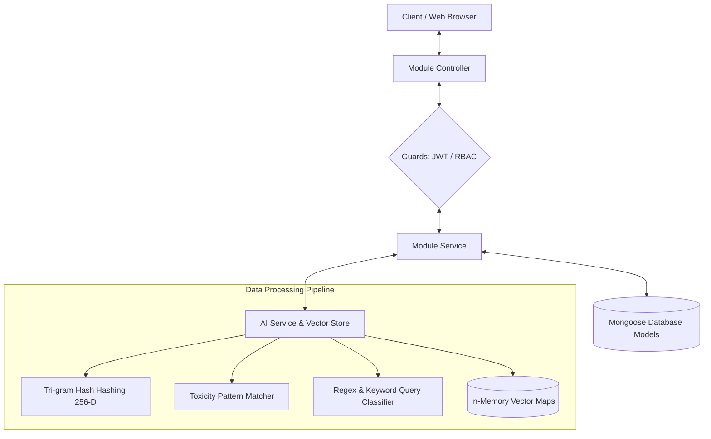

# Backend Architecture, User Flow, Data Flow, and File Analysis

This document provides a comprehensive breakdown of the NestJS-based backend application for the AI-powered Crowd-Sourced Dynamic FAQ Platform. It details the project's folder structure, user interaction flows, data propagation paths, and provides a file-by-file analysis including function definitions, inputs, and outputs.

---

## 1. Folder Structure

Below is the directory layout of the backend application:

```text
backend/
├── dist/                          # Compiled JavaScript production build output
├── node_modules/                  # Third-party dependencies installed via npm
├── src/                           # Root source code folder
│   ├── admin/                     # Content moderation, analytics, and admin commands
│   │   ├── admin.controller.ts    # Admin REST API endpoints
│   │   ├── admin.module.ts        # Admin module declaration and dependency injector
│   │   ├── admin.service.ts       # Business logic for administration and moderation
│   │   └── moderation-log.schema.ts # Mongoose schema for administrative audit logging
│   ├── ai/                        # AI-driven natural language processing mechanisms
│   │   ├── interfaces/            # Strict TypeScript contracts for AI sub-systems
│   │   │   ├── ai-service.interface.ts # Interface for toxicity analysis, embeddings, classification
│   │   │   └── vector-store.interface.ts # Interface for vector database operations
│   │   ├── ai.module.ts           # AI module configuration and injection token exports
│   │   ├── ai.service.ts          # Text embeddings, toxicity validation, and discussion summaries
│   │   └── vector-store.service.ts # In-memory similarity vector database search module
│   ├── auth/                      # Authentication, guard rules, and RBAC security
│   │   ├── auth.controller.ts     # Login, registration, and session info endpoints
│   │   ├── auth.module.ts         # Authentication configuration (Passport, JWT)
│   │   ├── auth.service.ts        # Password hashing, validation, and token creation
│   │   ├── jwt-auth.guard.ts      # Guard to protect endpoints with Bearer JWT tokens
│   │   ├── jwt.strategy.ts        # Passport strategy configuration for token parsing
│   │   ├── roles.decorator.ts     # Decorator for tagging endpoints with required user roles
│   │   └── roles.guard.ts         # Guard enforcing Role-Based Access Control (RBAC)
│   ├── faqs/                      # FAQ retrieval, bookmarking, and search feedback
│   │   ├── faq.schema.ts          # Mongoose schema for FAQ questions, answers, and embeddings
│   │   ├── faqs.controller.ts     # FAQ browsing and vector search endpoints
│   │   ├── faqs.module.ts         # FAQs module configuration
│   │   ├── faqs.service.ts        # Vector similarity search and feedback processing service
│   │   └── feedback.schema.ts     # Mongoose schema for storing user search match feedback
│   ├── questions/                 # Community Q&A forum module
│   │   ├── answer.schema.ts       # Mongoose schema for question answers
│   │   ├── bookmark.schema.ts     # Mongoose schema for saving items (FAQs/Questions) to user profiles
│   │   ├── question.schema.ts     # Mongoose schema for discussion questions
│   │   ├── questions.controller.ts # Community Q&A controller (voting, posting, accepting answers)
│   │   ├── questions.module.ts    # Questions module configuration
│   │   ├── questions.service.ts   # Q&A logic, reputation awarding, and toxicity checks
│   │   └── vote.schema.ts         # Mongoose schema for storing upvotes and downvotes
│   ├── users/                     # User profile management, notifications, and leaderboard
│   │   ├── notification.schema.ts # Mongoose schema for user system/inbox notifications
│   │   ├── user.schema.ts         # Mongoose schema for user accounts and roles
│   │   ├── users.controller.ts    # Leaderboards and profile retrieval endpoints
│   │   ├── users.module.ts        # Users module configuration
│   │   └── users.service.ts       # Reputation point modifications and notification dispatches
│   ├── app.module.ts              # Root application module importing all sub-modules
│   └── main.ts                    # Main entry point bootstrapping the NestJS server
├── .env                           # Local environment configuration file (ignored by Git)
├── nest-cli.json                  # NestJS CLI build and project configuration
├── package.json                   # Project metadata, dev/prod dependencies, and build scripts
├── package-lock.json              # Direct dependency resolution lockfile
├── tsconfig.json                  # Main TypeScript compilation configurations
└── tsconfig.build.json            # TypeScript configuration overrides for production building
```

---

## 2. User Flows

### A. Authentication & Onboarding Flow
1. **Registration**: 
   - A visitor posts their credentials (`email`, `passwordHash`, `name`) to `/api/auth/register`.
   - The system checks if the email is already registered. If not, it hashes the password with bcrypt and inserts a new `User` document.
   - **Auto-Onboarding**: If this is the first user in the database, the system automatically assigns them the `admin` role; otherwise, they receive the `user` role.
   - The server responds with a signed JWT token and user info.
2. **Login**: 
   - The user requests `/api/auth/login` with their `email` and `passwordHash`.
   - The system validates credentials. If valid, the user is issued a JWT containing their `userId`, `email`, and `role`.
3. **Session Query**:
   - The client includes the JWT as a Bearer token in subsequent requests. Sending a `GET` request to `/api/auth/me` validates the token and returns the current user's profile details.

### B. FAQ Search & Feedback Flow
1. **Search**:
   - The user inputs a query (e.g., "How do I reset my password?") which is sent to `/api/faqs/search`.
   - The AI service converts the query text into a normalized 256-dimension character tri-gram vector embedding.
   - The system performs a cosine similarity search against active, approved FAQs in the `VectorStore`.
   - If the best match has a similarity score $\ge 80\%$, the backend flags it with `discourageDuplicate: true` to prevent the user from opening an identical community thread.
   - The match raises the FAQ's `viewCount` metric by 1.
2. **Feedback**:
   - The user indicates whether the matched FAQ was helpful or not, sending feedback to `/api/faqs/feedback`.
   - If marked as helpful (`isHelpful: true`), the target FAQ's `useCount` is incremented.

### C. Public Community Q&A Flow
1. **Asking a Question**:
   - A user submits a question (`title`, `content`) to `/api/questions`.
   - **AI Toxicity Shield**: The text undergoes toxicity validation. If it contains flagged patterns or profanity, the system rejects it.
   - **AI Classification**: The text is evaluated to determine if it is a `personal` query (containing emails, SSNs, credit cards, billing IDs, etc.) or a `generic` query.
   - **Routing**:
     - *Generic*: Instantly published on the public board (`moderationStatus: 'approved'`). The user is awarded **+5 SP** (reputation points) for the contribution.
     - *Personal*: Marked as `pending` moderation, hidden from the public timeline, and routed to the administrator review queue.
2. **Answering a Question**:
   - Users view public questions and submit answers via `/api/questions/:id/answers`.
   - Answers undergo the AI Toxicity Shield.
   - On successful posting, the answer contributor is awarded **+10 SP** reputation points. The question author receives an inbox notification about the new response.
3. **Voting**:
   - Users vote on questions or answers at `/api/questions/:id/vote` or `/api/questions/answers/:answerId/vote`.
   - Upvoting/downvoting changes the item's `upvotes` tally.
   - For answers, net upvotes award **+5 SP** points to the author, while downvotes deduct **-5 SP** (with a floor of 0).
4. **Accepting an Answer**:
   - The question author marks an answer as the correct solution via `/api/questions/answers/:answerId/accept`.
   - The question is marked as closed (`isClosed: true`).
   - The answer contributor receives a **+30 SP** bonus.

### D. Admin Moderation & FAQ Extraction Flow
1. **Handling Personal Queries**:
   - Admins fetch private personal inquiries from `/api/admin/moderation/personal`.
   - An admin reviews the query and answers it via `/api/admin/moderation/personal/:id/review`.
   - This creates an accepted answer, closes the query, logs the moderator action, and dispatches a notification to the user's inbox.
2. **Generating FAQs from Discussions**:
   - If a community discussion has valuable answers, an admin trigger `/api/admin/summarize/:discussionId`.
   - The AI service gathers the question and its answers and summarizes them into a new FAQ candidate.
   - The candidate is saved in a pending state (`approvedBy: null`), keeping it invisible to public vector searches.
3. **Approving/Rejecting FAQ Candidates**:
   - Admins query pending candidates at `/api/admin/moderation/ai-faqs`.
   - **Approve**: Post to `/api/admin/moderation/ai-faqs/:id/approve` locks the admin's ID, activates the FAQ for public searches, and indexes it in the in-memory vector store.
   - **Reject**: Delete request to `/api/admin/moderation/ai-faqs/:id` discards the candidate.
4. **User Management**:
   - Admins fetch users via `/api/admin/users` and can ban/unban problematic accounts at `/api/admin/users/:id/ban`.

---

## 3. Data Flow

The flow of data through the backend components is summarized below:



### 1. Vector Search Data Flow
1. `Client` sends search text `query` to `FaqsController`.
2. `FaqsController` calls `FaqsService.searchSimilarFaqs(query)`.
3. `FaqsService` calls `AiService.generateEmbeddings(query)` to obtain a 256-dimension floating-point array (L2 normalized vector).
4. `FaqsService` feeds the embedding vector into `VectorStoreService.searchSimilar(vector, limit)`.
5. `VectorStoreService` computes the **cosine similarity** between the incoming query vector and each stored document vector:
   $$\text{Similarity} = \frac{A \cdot B}{\|A\| \|B\|}$$
6. Documents are sorted in descending order. The top matches are returned to the controller.

### 2. User Reputation & Notification Propagation Flow
1. User acts (e.g., answers a question).
2. `QuestionsService` calls `UsersService.awardReputationPoints(userId, points, title, message)`.
3. `UsersService` fetches the `User` document, increments the points, bounds it to a minimum of 0, and saves.
4. `UsersService` instantiates a new `Notification` document linked to the recipient user (`type: 'reputation'`) and saves it to MongoDB.
5. The next time the client polls/fetches `/api/users/notifications`, the updated alerts are returned.

---

## 4. File-by-File Analysis

### Root Configuration and Bootstrappers

#### 📄 [main.ts](file:///c:/REMYfolder/vs_code_folder/FAQ-project/backend/src/main.ts)
The entry point of the NestJS application. It bootstraps the Nest application, enables CORS, registers global DTO validation, and builds the Swagger UI documentation.
* **Important Functions**:
  * **`bootstrap()`**: Bootstraps the application.
    * *Input*: None.
    * *Output*: `Promise<void>`. Starts HTTP server listening on `process.env.PORT` or `5000`.

#### 📄 [app.module.ts](file:///c:/REMYfolder/vs_code_folder/FAQ-project/backend/src/app.module.ts)
The root NestJS module that ties together all domain feature modules and binds the global database connection.
* **Imports**: `ConfigModule`, `MongooseModule` (configured with `process.env.MONGODB_URI`), `AuthModule`, `UsersModule`, `AiModule`, `FaqsModule`, `QuestionsModule`, `AdminModule`.

---

### AI Module (`src/ai`)
Handles vector creation, content moderation rules, query classification, and in-memory vector storage.

#### 📄 [ai.module.ts](file:///c:/REMYfolder/vs_code_folder/FAQ-project/backend/src/ai/ai.module.ts)
Bundles and exports `AiService` and `VectorStoreService` with interface injection tokens (`IAiService`, `IVectorStore`).

#### 📄 [ai.service.ts](file:///c:/REMYfolder/vs_code_folder/FAQ-project/backend/src/ai/ai.service.ts)
Contains the algorithms for embeddings, toxicity checking, classification, and summaries.
* **Important Functions**:
  * **`generateEmbeddings(text)`**: Generates a dynamic character-level tri-gram hashing vector embedding (256 dimensions).
    * *Input*: `text: string`
    * *Output*: `Promise<number[]>` (An array of 256 floating-point values representing the normalized L2 unit vector).
  * **`analyzeToxicity(text)`**: Validates text against toxic words, abuse patterns, or database exploit attempts.
    * *Input*: `text: string`
    * *Output*: `Promise<{ isToxic: boolean; reason?: string }>`
  * **`classifyQuery(text)`**: Scans for personal identifiable information (PII) like email regexes, SSN patterns, phone numbers, or credit card billing queries.
    * *Input*: `text: string`
    * *Output*: `Promise<{ type: 'generic' | 'personal'; confidence: number }>`
  * **`generateFaqFromDiscussion(title, answers)`**: Aggregates community discussion details and synthesizes a structured FAQ entry.
    * *Input*: `title: string`, `answers: string[]`
    * *Output*: `Promise<{ question: string; answer: string }>`

#### 📄 [vector-store.service.ts](file:///c:/REMYfolder/vs_code_folder/FAQ-project/backend/src/ai/vector-store.service.ts)
An in-memory vector database using Map registries for cosine similarity queries.
* **Important Functions**:
  * **`addDocument(id, vector, metadata)`**: Inserts a document into vector store.
    * *Input*: `id: string`, `vector: number[]`, `metadata: any`
    * *Output*: `Promise<void>`
  * **`searchSimilar(vector, limit)`**: Computes similarity values using L2 cosine formula and returns sorted top items.
    * *Input*: `vector: number[]`, `limit: number`
    * *Output*: `Promise<IVectorStoreResult[]>` where `IVectorStoreResult` is `{ id: string; score: number; metadata: any }`.
  * **`removeDocument(id)`**: Deletes a record by ID.
    * *Input*: `id: string`
    * *Output*: `Promise<void>`
  * **`clear()`**: Wipes out all registered vectors.
    * *Input*: None
    * *Output*: `Promise<void>`
  * **`calculateCosineSimilarity(v1, v2)`**: Private mathematical helper that divides dot product by the product of vector norms.
    * *Input*: `v1: number[]`, `v2: number[]`
    * *Output*: `number` (similarity score between `0.0` and `1.0`).

#### 📄 [ai-service.interface.ts](file:///c:/REMYfolder/vs_code_folder/FAQ-project/backend/src/ai/interfaces/ai-service.interface.ts)
Defines the `IAiService` interface containing signatures for `generateEmbeddings`, `analyzeToxicity`, `classifyQuery`, and `generateFaqFromDiscussion`.

#### 📄 [vector-store.interface.ts](file:///c:/REMYfolder/vs_code_folder/FAQ-project/backend/src/ai/interfaces/vector-store.interface.ts)
Defines the `IVectorStoreResult` and `IVectorStore` interfaces containing method signatures for the vector database.

---

### Authentication Module (`src/auth`)
Secures endpoints, handles logins/registrations, and parses JWT payloads.

#### 📄 [auth.module.ts](file:///c:/REMYfolder/vs_code_folder/FAQ-project/backend/src/auth/auth.module.ts)
Binds the auth features, imports `PassportModule`, initializes `JwtModule` with a signature key, and registers `AuthService` and `JwtStrategy`.

#### 📄 [auth.controller.ts](file:///c:/REMYfolder/vs_code_folder/FAQ-project/backend/src/auth/auth.controller.ts)
Exposes endpoint paths for registry, logging in, and retrieving current sessions.
* **Important Functions**:
  * **`register(body)`**: Directs credentials to registration service.
    * *Input*: `body: { email: string; passwordHash: string; name: string }`
    * *Output*: `Promise<{ access_token: string; user: any }>`
  * **`login(body)`**: Directs credentials to login validation.
    * *Input*: `body: { email: string; passwordHash: string }`
    * *Output*: `Promise<{ access_token: string; user: any }>`
  * **`getMe(req)`**: Returns active profile information decoded from JWT.
    * *Input*: `req: Request` (containing authenticated `user` property injected by guard).
    * *Output*: `Promise<{ id: string; email: string; name: string; role: string; reputationPoints: number; bio: string }>`

#### 📄 [auth.service.ts](file:///c:/REMYfolder/vs_code_folder/FAQ-project/backend/src/auth/auth.service.ts)
Executes core registration and login logic, password hashing, and token signing.
* **Important Functions**:
  * **`register(registerDto)`**: Creates a user, hashes password, assigns role (makes the first user an admin), and generates a token.
    * *Input*: `registerDto: { email: string; passwordHash: string; name: string }`
    * *Output*: `Promise<{ access_token: string; user: any }>`
  * **`login(loginDto)`**: Checks if user exists, validates password using `bcrypt.compare()`, verifies if banned, and generates a JWT.
    * *Input*: `loginDto: { email: string; passwordHash: string }`
    * *Output*: `Promise<{ access_token: string; user: any }>`
  * **`generateToken(user)`**: Private helper that signs the payload using `JwtService`.
    * *Input*: `user: UserDocument`
    * *Output*: `{ access_token: string; user: { id: string; email: string; name: string; role: string; reputationPoints: number; bio: string } }`

#### 📄 [jwt.strategy.ts](file:///c:/REMYfolder/vs_code_folder/FAQ-project/backend/src/auth/jwt.strategy.ts)
Establishes the Passport JWT validation logic. Decodes Bearer tokens from request headers.
* **Important Functions**:
  * **`validate(payload)`**: Validates user from sub-claim ID and verifies they are not banned.
    * *Input*: `payload: { sub: string; email: string }`
    * *Output*: `Promise<UserDocument>`

#### 📄 [jwt-auth.guard.ts](file:///c:/REMYfolder/vs_code_folder/FAQ-project/backend/src/auth/jwt-auth.guard.ts)
A NestJS guard extending Passport's `AuthGuard('jwt')` to protect routes from unauthorized requests.

#### 📄 [roles.decorator.ts](file:///c:/REMYfolder/vs_code_folder/FAQ-project/backend/src/auth/roles.decorator.ts)
A custom decorator used to define which roles (`user`, `moderator`, `admin`) are permitted to access specific controller actions.

#### 📄 [roles.guard.ts](file:///c:/REMYfolder/vs_code_folder/FAQ-project/backend/src/auth/roles.guard.ts)
Guards paths by matching the current user's role against the roles requested via the `@Roles` decorator.
* **Important Functions**:
  * **`canActivate(context)`**: Inspects metadata and determines if user's role allows access.
    * *Input*: `context: ExecutionContext`
    * *Output*: `boolean`

---

### FAQs Module (`src/faqs`)
Handles core FAQ operations, similarity searching, bookmarking, and search feedback.

#### 📄 [faqs.module.ts](file:///c:/REMYfolder/vs_code_folder/FAQ-project/backend/src/faqs/faqs.module.ts)
Registers mongoose schemas for `Faq`, `Feedback`, and `Bookmark`, and connects them with the `FaqsService` and `FaqsController`.

#### 📄 [faq.schema.ts](file:///c:/REMYfolder/vs_code_folder/FAQ-project/backend/src/faqs/faq.schema.ts)
Mongoose Schema describing FAQs.
* **Fields**:
  * `question: string` (required, indexed)
  * `answer: string` (required)
  * `embedding: number[]` (required vector representation)
  * `isGenerated: boolean` (default false)
  * `approvedBy: ObjectId` (references User; null represents pending candidates)
  * `viewCount: number` (default 0)
  * `useCount: number` (default 0, tracks helpful feedback count)

#### 📄 [feedback.schema.ts](file:///c:/REMYfolder/vs_code_folder/FAQ-project/backend/src/faqs/feedback.schema.ts)
Mongoose Schema capturing user feedback on search results.
* **Fields**:
  * `userId: ObjectId` (optional reference to User)
  * `faqId: ObjectId` (required reference to Faq)
  * `queryText: string` (required)
  * `isHelpful: boolean` (required)
  * `comments: string` (default '')
  * `confidenceScore: number` (required confidence match score)

#### 📄 [faqs.controller.ts](file:///c:/REMYfolder/vs_code_folder/FAQ-project/backend/src/faqs/faqs.controller.ts)
Defines endpoints for looking up, creating, bookmarking, and giving feedback on FAQs.
* **Important Functions**:
  * **`getApproved()`**: Returns all approved FAQs.
    * *Input*: None
    * *Output*: `Promise<Faq[]>`
  * **`search(body)`**: Searches FAQs using AI similarity.
    * *Input*: `body: { query: string }`
    * *Output*: `Promise<{ bestMatch: any; suggestions: any[]; confidenceScore: number; discourageDuplicate: boolean }>`
  * **`submitFeedback(body)`**: Registers helpfulness feedback.
    * *Input*: `body: { userId?: string; faqId: string; queryText: string; isHelpful: boolean; comments?: string; confidenceScore: number }`
    * *Output*: `Promise<Feedback>`
  * **`toggleBookmark(req, id)`**: Bookmarks or unbookmarks an FAQ.
    * *Input*: `req: any`, `id: string` (FAQ ID)
    * *Output*: `Promise<{ bookmarked: boolean }>`
  * **`checkBookmark(req, id)`**: Checks if an FAQ is bookmarked.
    * *Input*: `req: any`, `id: string`
    * *Output*: `Promise<{ bookmarked: boolean }>`
  * **`createFaq(req, body)`**: Allows admins/moderators to manually add and publish a new FAQ.
    * *Input*: `req: any`, `body: { question: string; answer: string }`
    * *Output*: `Promise<Faq>`

#### 📄 [faqs.service.ts](file:///c:/REMYfolder/vs_code_folder/FAQ-project/backend/src/faqs/faqs.service.ts)
Contains business logic for FAQ management, vector search updates, and database querying.
* **Important Functions**:
  * **`onApplicationBootstrap()`**: Life-cycle hook that loads all FAQs from MongoDB and indexes them into the `VectorStore` memory at system boot.
    * *Input*: None
    * *Output*: `Promise<void>`
  * **`getAllApprovedFaqs()`**: Queries database for all FAQs.
    * *Input*: None
    * *Output*: `Promise<Faq[]>`
  * **`searchSimilarFaqs(queryText)`**: Calculates embeddings for query, performs search in `VectorStore`, increments view count for the top match, and returns similarity scores.
    * *Input*: `queryText: string`
    * *Output*: `Promise<{ bestMatch: any; suggestions: any[]; confidenceScore: number; discourageDuplicate: boolean }>`
  * **`createFaq(faqDto)`**: Saves an FAQ, handles exact-question conflict checks, computes embeddings, saves to DB, and adds it to `VectorStore`.
    * *Input*: `faqDto: { question: string; answer: string; approvedBy?: string; isGenerated?: boolean }`
    * *Output*: `Promise<Faq>`
  * **`submitFeedback(feedbackDto)`**: Saves user feedback on search results and updates the FAQ's `useCount` if helpful.
    * *Input*: `feedbackDto` object
    * *Output*: `Promise<Feedback>`
  * **`toggleBookmark(userId, faqId)`**: Toggles bookmark entry.
    * *Input*: `userId: string`, `faqId: string`
    * *Output*: `Promise<{ bookmarked: boolean }>`
  * **`isBookmarked(userId, faqId)`**: Checks if a bookmark exists.
    * *Input*: `userId: string`, `faqId: string`
    * *Output*: `Promise<boolean>`

---

### Questions Module (`src/questions`)
Enables the community Q&A features (posting, answering, voting, and accepting answers).

#### 📄 [questions.module.ts](file:///c:/REMYfolder/vs_code_folder/FAQ-project/backend/src/questions/questions.module.ts)
Wires up `Question`, `Answer`, `Vote`, `Bookmark`, and `User` database collections with the QA controller and service.

#### 📄 [question.schema.ts](file:///c:/REMYfolder/vs_code_folder/FAQ-project/backend/src/questions/question.schema.ts)
Mongoose Schema representing a question.
* **Fields**:
  * `title: string` (required)
  * `content: string` (required)
  * `type: 'generic' | 'personal'` (default: 'generic')
  * `author: ObjectId` (references User)
  * `embedding: number[]` (optional question vector representation)
  * `isModerated: boolean` (default false)
  * `moderationStatus: 'approved' | 'pending' | 'rejected'` (default: 'approved')
  * `upvotes: number` (default 0)
  * `answerCount: number` (default 0)
  * `isClosed: boolean` (default false)

#### 📄 [answer.schema.ts](file:///c:/REMYfolder/vs_code_folder/FAQ-project/backend/src/questions/answer.schema.ts)
Mongoose Schema representing a response/answer.
* **Fields**:
  * `questionId: ObjectId` (references Question)
  * `author: ObjectId` (references User)
  * `content: string` (required)
  * `upvotes: number` (default 0)
  * `isAccepted: boolean` (default false)
  * `isModerated: boolean` (default false)

#### 📄 [vote.schema.ts](file:///c:/REMYfolder/vs_code_folder/FAQ-project/backend/src/questions/vote.schema.ts)
Mongoose Schema storing user upvotes and downvotes to prevent double voting.
* **Fields**:
  * `userId: ObjectId` (references User)
  * `targetId: ObjectId` (references Question or Answer)
  * `targetType: 'question' | 'answer'`
  * `value: number` (`1` for upvote, `-1` for downvote)
  * *Index*: Compound unique index on `{ userId: 1, targetId: 1 }`

#### 📄 [bookmark.schema.ts](file:///c:/REMYfolder/vs_code_folder/FAQ-project/backend/src/questions/bookmark.schema.ts)
Mongoose Schema representing bookmarked items.
* **Fields**:
  * `userId: ObjectId` (references User)
  * `itemId: ObjectId` (references Question or Faq)
  * `itemType: 'faq' | 'question'`
  * *Index*: Compound unique index on `{ userId: 1, itemId: 1 }`

#### 📄 [questions.controller.ts](file:///c:/REMYfolder/vs_code_folder/FAQ-project/backend/src/questions/questions.controller.ts)
Exposes endpoints for posting questions, submitting answers, voting, bookmarking, and accepting answers.
* **Important Functions**:
  * **`getQuestions(sort)`**: Retrieves sorted questions list.
    * *Input*: `sort?: 'recent' | 'upvoted' | 'unanswered'`
    * *Output*: `Promise<Question[]>`
  * **`getUserVotes(req)`**: Returns user's voting history.
    * *Input*: `req: any`
    * *Output*: `Promise<Record<string, number>>`
  * **`getDetails(id, userId)`**: Fetches details of a specific question and its answers.
    * *Input*: `id: string` (Question ID), `userId?: string`
    * *Output*: `Promise<{ question: Question; answers: Answer[] }>`
  * **`raiseQuery(req, body)`**: Posts a new question to the forum.
    * *Input*: `req: any`, `body: { title: string; content: string }`
    * *Output*: `Promise<{ question: Question; classification: any; message: string }>`
  * **`submitAnswer(req, id, body)`**: Submits an answer to a question.
    * *Input*: `req: any`, `id: string` (Question ID), `body: { content: string }`
    * *Output*: `Promise<Answer>`
  * **`voteQuestion(req, id, body)`**: Casts a vote on a question.
    * *Input*: `req: any`, `id: string`, `body: { value: number }`
    * *Output*: `Promise<{ upvotes: number }>`
  * **`voteAnswer(req, answerId, body)`**: Casts a vote on an answer.
    * *Input*: `req: any`, `answerId: string`, `body: { value: number }`
    * *Output*: `Promise<{ upvotes: number }>`
  * **`acceptAnswer(req, answerId)`**: Selects an answer as the accepted solution.
    * *Input*: `req: any`, `answerId: string`
    * *Output*: `Promise<Answer>`
  * **`toggleBookmark(req, id)`**: Saves or removes a question bookmark.
    * *Input*: `req: any`, `id: string`
    * *Output*: `Promise<{ bookmarked: boolean }>`
  * **`checkBookmark(req, id)`**: Checks if a question is bookmarked.
    * *Input*: `req: any`, `id: string`
    * *Output*: `Promise<{ bookmarked: boolean }>`

#### 📄 [questions.service.ts](file:///c:/REMYfolder/vs_code_folder/FAQ-project/backend/src/questions/questions.service.ts)
Contains the core business logic of the QA system.
* **Important Functions**:
  * **`getCommunityQuestions(sort)`**: Queries, filters out unapproved/personal questions, and returns sorted lists.
    * *Input*: `sort: 'recent' | 'upvoted' | 'unanswered'`
    * *Output*: `Promise<Question[]>`
  * **`getQuestionDetails(questionId, userId)`**: Returns a question and its answers. Restricts access to personal queries if the user is not the author, an admin, or a moderator.
    * *Input*: `questionId: string`, `userId?: string`
    * *Output*: `Promise<{ question: QuestionDocument; answers: AnswerDocument[] }>`
  * **`raiseQuery(userId, questionDto)`**: Screens for toxicity and classifies text. If personal, routes to pending moderation status; if generic, posts to board and awards user **+5 SP**.
    * *Input*: `userId: string`, `questionDto: { title: string; content: string }`
    * *Output*: `Promise<{ question: QuestionDocument; classification: any; message: string }>`
  * **`submitAnswer(userId, questionId, answerDto)`**: Performs toxicity screen, registers answer, increments question's answer count, awards **+10 SP** to contributor, and notifies question author.
    * *Input*: `userId: string`, `questionId: string`, `answerDto: { content: string }`
    * *Output*: `Promise<AnswerDocument>`
  * **`voteQuestion(userId, questionId, value)`**: Registers vote, handles vote toggling/retractions, and updates question upvote score.
    * *Input*: `userId: string`, `questionId: string`, `value: number`
    * *Output*: `Promise<{ upvotes: number }>`
  * **`voteAnswer(userId, answerId, value)`**: Registers vote, updates answer score, and awards/deducts reputation points from answer author (+5 SP per net upvote).
    * *Input*: `userId: string`, `answerId: string`, `value: number`
    * *Output*: `Promise<{ upvotes: number }>`
  * **`acceptAnswer(userId, answerId)`**: Verifies question author, marks answer as accepted, updates question to closed, and awards contributor **+30 SP**.
    * *Input*: `userId: string`, `answerId: string`
    * *Output*: `Promise<AnswerDocument>`
  * **`toggleBookmark(userId, questionId)`**: Toggles bookmark and awards **+2 SP** to question author on a bookmark addition.
    * *Input*: `userId: string`, `questionId: string`
    * *Output*: `Promise<{ bookmarked: boolean }>`
  * **`isBookmarked(userId, questionId)`**: Checks if a bookmark exists.
    * *Input*: `userId: string`, `questionId: string`
    * *Output*: `Promise<boolean>`
  * **`getUserVotes(userId)`**: Returns mapped dictionary of IDs containing the user's vote direction values.
    * *Input*: `userId: string`
    * *Output*: `Promise<Record<string, number>>`

---

### Users Module (`src/users`)
Manages leaderboards, profile statistics, and notifications.

#### 📄 [users.module.ts](file:///c:/REMYfolder/vs_code_folder/FAQ-project/backend/src/users/users.module.ts)
Registers `User`, `Notification`, `Bookmark`, `Question`, and `Faq` schemas and links them with `UsersService` and `UsersController`.

#### 📄 [user.schema.ts](file:///c:/REMYfolder/vs_code_folder/FAQ-project/backend/src/users/user.schema.ts)
Mongoose Schema representing a user account.
* **Fields**:
  * `email: string` (required, unique, indexed)
  * `passwordHash: string` (required)
  * `name: string` (required)
  * `role: 'user' | 'moderator' | 'admin'` (default: 'user')
  * `reputationPoints: number` (default 0)
  * `isBanned: boolean` (default false)
  * `bio: string` (default '')

#### 📄 [notification.schema.ts](file:///c:/REMYfolder/vs_code_folder/FAQ-project/backend/src/users/notification.schema.ts)
Mongoose Schema representing system notifications.
* **Fields**:
  * `recipient: ObjectId` (references User)
  * `title: string` (required)
  * `message: string` (required)
  * `isRead: boolean` (default false)
  * `type: 'reputation' | 'answer' | 'system' | 'moderation'` (required enum)

#### 📄 [users.controller.ts](file:///c:/REMYfolder/vs_code_folder/FAQ-project/backend/src/users/users.controller.ts)
Exposes endpoints for user profiles, notifications, and contributor rankings.
* **Important Functions**:
  * **`getLeaderboard(limit)`**: Retrieves top active contributors.
    * *Input*: `limit?: string` (Query parameter)
    * *Output*: `Promise<User[]>`
  * **`getUserProfile(id)`**: Fetches a user's details and counts of questions asked.
    * *Input*: `id: string` (User ID)
    * *Output*: `Promise<{ user: User; stats: { questionsAsked: number } }>`
  * **`getNotifications(req)`**: Returns notifications.
    * *Input*: `req: any`
    * *Output*: `Promise<Notification[]>`
  * **`markAsRead(req, id)`**: Marks a notification as read.
    * *Input*: `req: any`, `id: string` (Notification ID)
    * *Output*: `Promise<{ success: boolean }>`
  * **`getBookmarks(req)`**: Fetches all bookmarks (FAQs/questions) saved by the user.
    * *Input*: `req: any`
    * *Output*: `Promise<any[]>`

#### 📄 [users.service.ts](file:///c:/REMYfolder/vs_code_folder/FAQ-project/backend/src/users/users.service.ts)
Manages user profiles, leaderboard aggregation, and notification dispatches.
* **Important Functions**:
  * **`getUserProfile(id)`**: Retrieves a user's profile and count of questions asked.
    * *Input*: `id: string`
    * *Output*: `Promise<{ user: UserDocument; stats: { questionsAsked: number } }>`
  * **`getLeaderboard(limit)`**: Fetches users sorted by reputation score.
    * *Input*: `limit: number`
    * *Output*: `Promise<UserDocument[]>`
  * **`awardReputationPoints(userId, points, title, message)`**: Awards/deducts reputation points and dispatches a system notification.
    * *Input*: `userId: string`, `points: number`, `title: string`, `message: string`
    * *Output*: `Promise<void>`
  * **`getNotifications(userId)`**: Returns notifications for a user (limit 50).
    * *Input*: `userId: string`
    * *Output*: `Promise<NotificationDocument[]>`
  * **`markNotificationAsRead(userId, notificationId)`**: Marks a notification as read.
    * *Input*: `userId: string`, `notificationId: string`
    * *Output*: `Promise<{ success: boolean }>`
  * **`getBookmarks(userId)`**: Fetches and returns bookmarked items (FAQs/questions).
    * *Input*: `userId: string`
    * *Output*: `Promise<any[]>`

---

### Admin Module (`src/admin`)
Provides moderation endpoints for analytics, user management, and AI FAQ Extraction.

#### 📄 [admin.module.ts](file:///c:/REMYfolder/vs_code_folder/FAQ-project/backend/src/admin/admin.module.ts)
Binds admin features, imports schemas, and wires up `AdminService` and `AdminController`.

#### 📄 [moderation-log.schema.ts](file:///c:/REMYfolder/vs_code_folder/FAQ-project/backend/src/admin/moderation-log.schema.ts)
Mongoose Schema representing administrative actions taken by admins/moderators.
* **Fields**:
  * `moderatorId: ObjectId` (references User)
  * `action: 'ban_user' | 'unban_user' | 'delete_question' | 'approve_faq' | 'reject_faq' | 'moderate_answer'` (required enum)
  * `targetId: ObjectId` (ID of the targeted entity)
  * `reason: string` (required explanation)

#### 📄 [admin.controller.ts](file:///c:/REMYfolder/vs_code_folder/FAQ-project/backend/src/admin/admin.controller.ts)
Exposes endpoints for moderation, user banning, and FAQ candidates. Protected by `JwtAuthGuard` and `RolesGuard`.
* **Important Functions**:
  * **`getAnalytics()`**: Permitted for admins/moderators. Fetches platform usage statistics.
    * *Input*: None
    * *Output*: `Promise<any>`
  * **`getUsers()`**: Admin-only. Retrieves a list of users.
    * *Input*: None
    * *Output*: `Promise<User[]>`
  * **`toggleBan(req, id, body)`**: Admin-only. Bans or unbans a user.
    * *Input*: `req: any`, `id: string` (Target user ID), `body: { reason?: string }`
    * *Output*: `Promise<{ banned: boolean; user: User }>`
  * **`getPersonalQueries()`**: Admins/moderators list personal inquiries awaiting review.
    * *Input*: None
    * *Output*: `Promise<Question[]>`
  * **`reviewPersonal(req, id, body)`**: Admins/moderators reply to a personal query.
    * *Input*: `req: any`, `id: string` (Query ID), `body: { answerContent: string }`
    * *Output*: `Promise<{ success: boolean }>`
  * **`summarizeDiscussion(req, discussionId)`**: Synthesizes a thread into an FAQ candidate.
    * *Input*: `req: any`, `discussionId: string`
    * *Output*: `Promise<Faq>`
  * **`getGeneratedCandidates()`**: Lists pending FAQ candidates.
    * *Input*: None
    * *Output*: `Promise<Faq[]>`
  * **`approveFaq(req, id)`**: Approves and activates an FAQ candidate.
    * *Input*: `req: any`, `id: string` (FAQ Candidate ID)
    * *Output*: `Promise<Faq>`
  * **`rejectFaq(req, id)`**: Rejects and deletes an FAQ candidate.
    * *Input*: `req: any`, `id: string`
    * *Output*: `Promise<{ success: boolean }>`

#### 📄 [admin.service.ts](file:///c:/REMYfolder/vs_code_folder/FAQ-project/backend/src/admin/admin.service.ts)
Main service implementing admin-level actions.
* **Important Functions**:
  * **`getAnalytics()`**: Computes numbers for users, approved FAQs, generic/personal queries, and calculates feedback satisfaction percentage.
    * *Input*: None
    * *Output*: `Promise<{ usersCount: number; faqsCount: number; questionsCount: number; resolvedQuestionsCount: number; personalQueriesCount: number; helpfulFeedbackCount: number; totalFeedbackCount: number; satisfactionRate: number }>`
  * **`getAllUsers()`**: Queries database for all users, excluding passwords.
    * *Input*: None
    * *Output*: `Promise<User[]>`
  * **`toggleUserBan(adminId, userId, reason)`**: Changes user ban state and saves a `ModerationLog`.
    * *Input*: `adminId: string`, `userId: string`, `reason: string`
    * *Output*: `Promise<{ banned: boolean; user: User }>`
  * **`getPersonalQueries()`**: Retrieves pending personal queries.
    * *Input*: None
    * *Output*: `Promise<Question[]>`
  * **`reviewPersonalQuery(adminId, queryId, responseDto)`**: Answers private query, marks it resolved, updates status, saves moderation log, and notifies the author.
    * *Input*: `adminId: string`, `queryId: string`, `responseDto: { answerContent: string }`
    * *Output*: `Promise<{ success: boolean }>`
  * **`generateFaqFromDiscussion(adminId, discussionId)`**: Fetches thread answers, calls `AiService.generateFaqFromDiscussion()`, generates embeddings for the question, and saves it as a pending FAQ.
    * *Input*: `adminId: string`, `discussionId: string`
    * *Output*: `Promise<FaqDocument>`
  * **`getAiGeneratedFaqCandidates()`**: Returns pending candidates.
    * *Input*: None
    * *Output*: `Promise<Faq[]>`
  * **`approveFaq(adminId, faqId)`**: Marks FAQ candidate as approved, indexes it in `VectorStoreService`, and logs the action.
    * *Input*: `adminId: string`, `faqId: string`
    * *Output*: `Promise<FaqDocument>`
  * **`rejectFaq(adminId, faqId)`**: Wipes the FAQ candidate from Mongoose.
    * *Input*: `adminId: string`, `faqId: string`
    * *Output*: `Promise<{ success: boolean }>`
